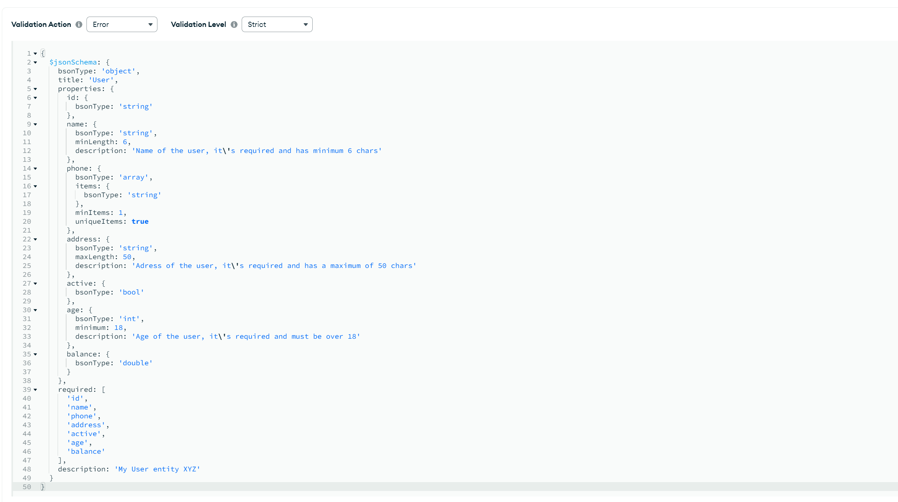
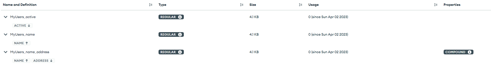

# mongrr-schema

Typescript MongoDB Schema Generator

## Motivation

Generate and keep your MongoDB Schema Validation up-to-date based on your types!        

Types are/should be always up-to-date in order to enable proper Typescript usage.      
This library' aim is to automate the mundane task of keeping the MongoDB Schema Validation in sync with your API or various services types. 

### Installing

```
npm install --save mongrr-schema
```

### Usage

##### Basic
Given a target file
```typescript
// ./lib/models/User.ts
export default class User {
    id: number;

    phone?: Array<string>;

    address: Address;

    active: boolean;
}

class Address {
    street: string;

    county: string;

    flatNumber?: number;
}
```

Simple generation e.g.
```typescript
// index.ts
import { Generator } from 'mongrr-schema';

async function main() {

    await Generator.generate({
        files: ['./lib/models/User.ts'],
        callerBaseDir: __dirname,
        connectionString: 'mongodb://localhost:27017', // actual mongodb conn string
        databaseName: 'myExampleDb' // target db to use
    });

}

main().catch(console.error);
```
##### Runtime without access to /src type files

###### Using tparserr to generate type description file

tparserr can be installed as dev and attached to build
```
npm install --save-dev tparserr
```
with e.g. npm script attached to the build
```
"build:types": "tparserr generate -f=./src/lib/models/User.ts -o=./schema.json"
```
can simply
```typescript
await Generator.generateForTypes({
    connectionString: 'mongodb://localhost:27017', // actual mongodb conn string
    databaseName: databaseName // target db to use
}, './schema.json');
```
###### Note: to enable decorators and other options - see https://github.com/razmat145/tparserr#configuration
```
"build:types": "tparserr generate -f=./src/lib/models/User.ts -o=./schema.json" --includeOnlyExports=true --enableDecorators=true
```
##### Decorators
Decorators can be used to influence the MongoDB schema generation by applying various modifiers or by outright changing the behaviour completely.   
```typescript
import {
    CollectionName,
    Index,
    CompoundIndex,
    Int,
    Double,
    Minimum,
    MinLength,
    MaxLength,
    Description,
    MinItems,
    UniqueItems
} from 'mongrr-schema'

@Description('My User entity XYZ')
@CompoundIndex(
    ['name'],
    ['address', 'desc']
)
@CollectionName('MyUsers')
export class User {
    id: string;

    @Index()
    @MinLength(6)
    @Description(`Name of the user, it's required and has minimum 6 chars`)
    name: string;

    @MinItems(1)
    @UniqueItems(true)
    phone: Array<string>;

    @MaxLength(50)
    @Description(`Adress of the user, it's required and has a maximum of 50 chars`)
    address: string;

    @Index('desc')
    active: boolean;

    @Int()
    @Minimum(18)
    @Description(`Age of the user, it's required and must be over 18`)
    age: number;

    @Double()
    balance: number;
}
```
With created schema   



And created indexes   



### Supported Decorators
Decorator naming aims to stay as close to MongoDB docs/namings as possible (where possible) - the only exception is them being `@CapitalCamelCased`   
##### Generic Decorators
- `@Description` - attaches description metadata to classes and properties
##### Class Decorators
- `@CollectionName(name: string)` - using the specified name when creating/updating the collection schema
- `@CompoundIndex(..args: Array<[propertyPath, 'asc' | 'desc']>)` - creating a compound index on the `[path, direction]` provided arguments
 
##### Property Decorators
###### Generic
- `@Index()` - creating an index on decorated property

###### Number Type
- `@Double()` - modifier that marks the `number` as a `double` BSON type
- `@Long()` - modifier that marks the `number` as a `long` BSON type
- `@Int()` - modifier that marks the `number` as a `int` BSON type
- `@Decimal()` - modifier that marks the `number` as a `decimal` BSON type
- `@Minimum(min: number)` - modifier that enforces the `min` value
- `@Maximum(max: number)` - modifiers that enforces the `max` value
###### String Type
- `@MinLength(minLength: number)` - modifier that enforces the `minLength` value
- `@MaxLength(maxLength: number)` - modifiers that enforces the `maxLength` value
###### Array Type
- `@MinItems(minItems: number)` - modifier that enforces the length of the array to the specified `minItems` value
- `@MaxItems(maxItems: number)` -  modifier that enforces the length of the array to the specified `maxItems` value
- `@UniqueItems(hasUniqueItems: boolean)` - modifier that enforces array item uniqueness

### Configuration
FilePath opts are inherited by tparserr dependency - see https://github.com/razmat145/tparserr#configuration for more info 
```typescript
type TParserOptsPaths = Pick<IParserOpts,
    'files'
    | 'useRelativePaths'
    | 'callerBaseDir'
    | 'targetDir'
    | 'includeOnlyExports'
    | 'includeNestedClassNames'
    | 'enableDecorators'
>;

interface IGeneratorOpts extends TParserOptsPaths {
    // requires either connection details
    connectionString?: string; // mongodb connection string

    databaseName?: string; // database name to create/use

    // OR
    mongoDb?: Db; // MongoDB (database ref) Db type
}
```

## License
This library is licensed under the Apache 2.0 License