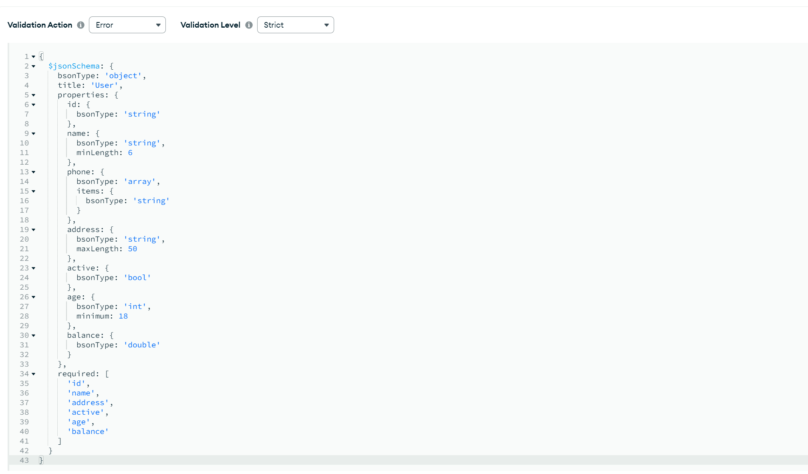

# mongrr-schema

Typescript MongoDB Schema Generator

## Motivation

Generate and keep your MongoDB Schema Validation up-to-date based on your types!        

Types are/should be always up-to-date in order to enable proper Typescript usage.      
This library' aim is to automate the mundane task of keeping the MongoDB Schema Validation in sync with your API or various services types. 

### Installing

```
npm install --save mongrr-schema
```

### Usage

##### Basic
Given a target file
```typescript
// ../targetFiles/User.ts
export default class User {
    id: number;

    phone?: Array<string>;

    address: Address;

    active: boolean;
}

class Address {
    street: string;

    county: string;

    flatNumber?: number;
}
```

Simple generation e.g.
```typescript
// index.ts
import { MongoClient } from 'mongodb';

import { Generator } from 'mongrr-schema';

async function main() {

    const client = new MongoClient('mongodb://localhost:27017'); // actual mongodb connString
    const databaseName = 'myExampleDb'; // target database

    await client.connect();

    await Generator.generate({
        files: ['../targetFiles/User.ts'],
        callerBaseDir: __dirname,
        mongoDb: client.db(databaseName)
    });

}

main().catch(console.error);
```
##### Decorators
Decorators can be used to incluence the MongoDB schema generation by applying various modifiers or by outright changing the behaviour completely.
```typescript
import {
    CollectionName,
    Index,
    CompoundIndex,
    Int,
    Double,
    Minimum,
    MinLength,
    MaxLength
} from 'mongrr-schema'

@CompoundIndex(
    ['name'],
    ['address', 'desc']
)
@CollectionName('MyUsers')
export class User {
    id: string;

    @Index()
    @MinLength(6)
    name: string;

    phone?: Array<string>;

    @MaxLength(50)
    address: string;

    @Index('desc')
    active: boolean;

    @Int()
    @Minimum(18)
    age: number;

    @Double()
    balance: number;
}
```
With created schema   



And created indexes   


### Supported Decorators
Decorator naming aims to stay as close to MongoDB docs/namings as possible (where possible) - the only exception is them being `@CapitalCamelCased`
##### Class Decorators
- `@CollectionName(name: string)` - using the specified name when creating/updating the collection schema
- `@CompoundIndex(..args: Array<[propertyPath, 'asc' | 'desc']>)` - creating a compound index on the `[path, direction]` provided arguments
 
##### Property Decorators
###### Generic
- `@Index()` - creating an index on decorated property

###### Number Type
- `@Double()` - modifier that marks the `number` as a `double` BSON type
- `@Long()` - modifier that marks the `number` as a `long` BSON type
- `@Int()` - modifier that marks the `number` as a `int` BSON type
- `@Decimal()` - modifier that marks the `number` as a `decimal` BSON type
- `@Minimum(min: number)` - modifier that enforces the `min` value
- `@Maximum(max: number)` - modifiers that enforces the `max` value
###### String Type
- `@MinLength(minLength: number)` - modifier that enforces the `minLength` value
- `@MaxLength(maxLength: number)` - modifiers that enforces the `maxLength` value


### Configuration
FilePath opts are inherited by tparserr dependency - see https://github.com/razmat145/tparserr#configuration for more info 
```typescript
type TParserOptsPaths = Pick<IParserOpts,
    'files'
    | 'useRelativePaths'
    | 'callerBaseDir'
    | 'targetDir'
    | 'includeOnlyExports'
    | 'includeNestedClassNames'
    | 'enableDecorators'
>;

interface IGeneratorOpts extends TParserOptsPaths {
    mongoDb: Db; // MongoDB Db type
}
```

#### (Known) Limitations
- some file pathing limitations are inherited from `tparserr` - see https://github.com/razmat145/tparserr#known-limitations

## License
This library is licensed under the Apache 2.0 License