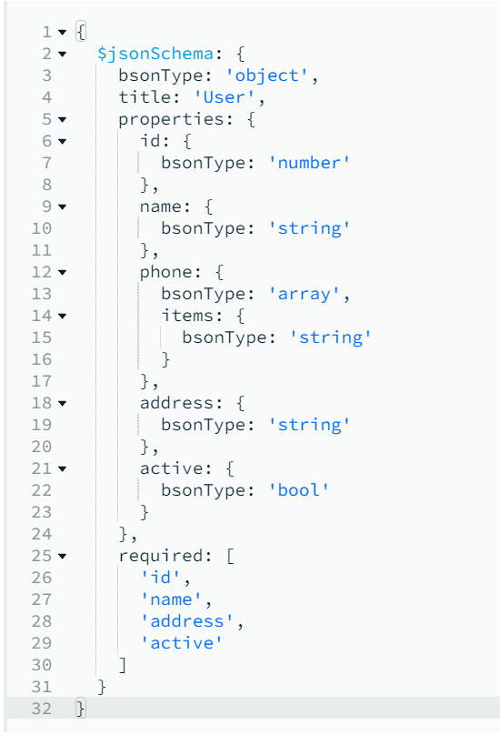
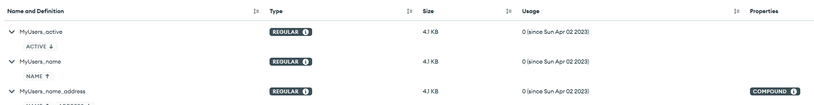

# mongrr-schema

Typescript MongoDB Schema Generator

## Motivation

Generate and keep your MongoDB Schema Validation up-to-date based on your types!        

Types are/should be always up-to-date in order to enable proper Typescript usage.      
This library' aim is to automate the mundayne task of keeping the MongoDB Schema Validation in sync with your API or various services types. 

### Installing

```
npm install --save mongrr-schema
```

### Usage

##### Basic
Given a target file
```typescript
// ../targetFiles/User.ts
export default class User {
    id: number;

    phone?: Array<string>;

    address: Address;

    active: boolean;
}

class Address {
    street: string;

    county: string;

    flatNumber?: number;
}
```

Simple generation e.g.
```typescript
// index.ts
import { MongoClient } from 'mongodb';

import { Generator } from 'mongrr-schema';

async function main() {

    const client = new MongoClient('mongodb://localhost:27017'); // actual mongodb connString
    const databaseName = 'myExampleDb'; // target database

    await client.connect();

    await Generator.generate({
        files: ['../targetFiles/User.ts'],
        callerBaseDir: __dirname,
        mongoDb: client.db(databaseName)
    });

}

main().catch(console.error);
```
##### Decorators
Decorators can be used to instruct the generator to make various decisions
```typescript
import { CollectionName, Index, CompoundIndex } from 'mongrr-schema'

@CompoundIndex(
    ['name'],
    ['address', 'desc']
) // instructs the generator to use a compound index on name-asc and address-desc
@CollectionName('MyUsers') // instructs the generator to use the specified collection name
export class User {
    id: number;

    @Index() // instructs the generator to create an ascending index on 'name' path
    name: string;

    phone?: Array<string>;

    address: string;

    @Index('desc') // instructs the generator to create an descending index on 'active' path
    active: boolean;
}
```
With created schema   



And created indexes   



### Configuration
FilePath opts are inherited by tparserr dependency - see https://github.com/razmat145/tparserr#configuration for more info 
```typescript
type TParserOptsPaths = Pick<IParserOpts,
    'files'
    | 'useRelativePaths'
    | 'callerBaseDir'
    | 'targetDir'
    | 'includeOnlyExports'
    | 'includeNestedClassNames'
    | 'enableDecorators'
>;

interface IGeneratorOpts extends TParserOptsPaths {
    mongoDb: Db; // MongoDB Db type
}
```
#### (Known) Limitations
- some file pathing limitations are inherited from `tparserr` - see https://github.com/razmat145/tparserr#known-limitations

## License
This library is licensed under the Apache 2.0 License
